<!--- Your existing banner image here --->

  

# 💻 My favorite tools and technologies

### 🛠️ Languages & Core

### 🌐 Frontend (MERN)

### ⚙️ Backend & Database

### 🔧 Tools & Workflow

## 📊 GitHub Stats

  
  
  

<!-- Snake Animation - Updates automatically! -->

  

